# API 흐름

각 엔드포인트가 요청을 받아 응답을 내려주기까지 실제로 어떤 순서로 LLM/DB를
타는지 정리한 문서. 코드 기준(수동 업데이트) — 라우터/도구 함수가 바뀌면
이 문서도 같이 갱신해야 한다.

## 범례

- 🟠 **LLM 호출** — `llm/client.py`의 `complete_json()`을 거친다
- 🟢 **DB 조회·기록**
- ⬜ **로직만** — LLM/DB 없이 순수 코드로 처리
- 점선 테두리 — 조건을 만족할 때만 실행됨

## 공통: `llm/client.py`

모든 LLM 호출은 이 파일의 `complete_json()`을 거친다.

- JSON 모드를 강제하고, 파싱 실패 시 1회 재시도
- 503 · RateLimit · Timeout 등 일시적 오류는 최대 3회, 지수 백오프로 재시도
- 재시도까지 실패하면 `FALLBACK_MODEL`로 한 번 더 시도 (비어 있으면 바로 실패)
- 기본 모델 `MODEL=gemini/gemini-3.6-flash`, `reasoning_effort=low`로 thinking
  토큰 절감

---

## Concepts 라우터 (`app/routers/concepts.py`)

### `POST /concepts/interpret` — 등록 전 의미 해석

동음이의어면 2~3개, 아니면 1개 의미 후보를 LLM이 추론.

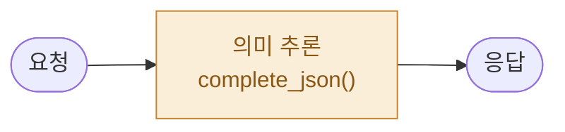

### `POST /concepts` — 개념 등록

같은 `term`이 이미 있으면 400으로 거부.

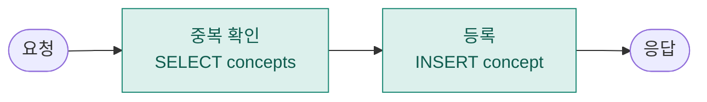

### `GET /concepts` — 목록 조회

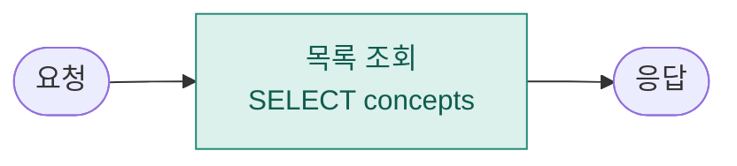

### `POST /concepts/{id}/explain` — 쉬운 풀이 생성

등록된 축약 정의를 비유·예시를 곁들여 초보자용으로 재설명.

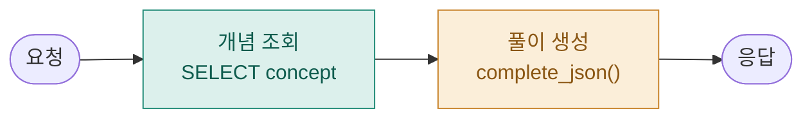

### `POST /concepts/{id}/quiz` — 퀴즈 생성 (조건부 LLM)

`type=mc`면 LLM이 응용형 객관식을 출제. `type=free`면 LLM 없이 고정 템플릿
문장만 돌려준다.

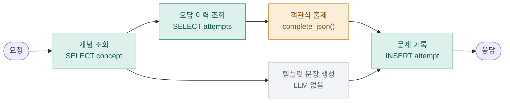

### `POST /concepts/{id}/quiz/answer` — 채점 + 게이지 갱신 (조건부 LLM)

객관식은 정답 문자열을 로컬 비교, 서술형만 LLM이 0~100점으로 채점.

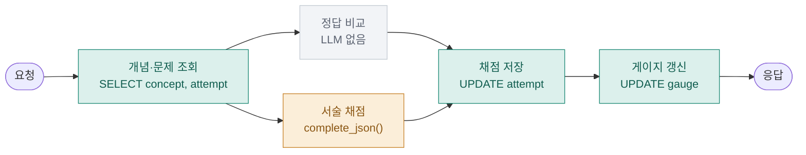

### `POST /concepts/{id}/master` — 마스터 처리 (소프트 삭제)

status만 `mastered`로 바뀐다 — 행과 이력은 그대로 남는다.

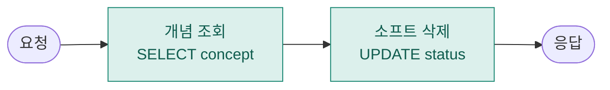

---

## Notes 라우터 (`app/routers/notes.py`)

### `GET /notes` — 전체 메모 조회

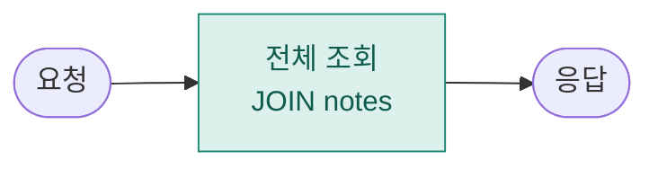

### `POST /concepts/{id}/notes` — 메모 작성 + 멘션 추출

메모 저장 후, 본문에서 다른 등록된 개념이 언급됐는지 LLM으로 판별해 역링크를
남긴다 (언급이 없으면 `INSERT note_link`는 실행되지 않음 — 점선 테두리).

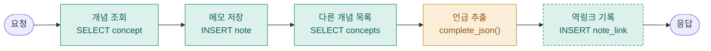

### `GET /concepts/{id}/notes` — 개념별 메모 + 역링크

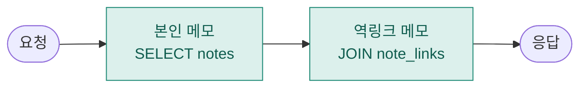

---

## Code 라우터 (`app/routers/code.py`)

코드 문제는 `concepts`와 달리 사용자가 등록하는 게 아니라 `db/seed.py`가 기동 시
채워두는 콘텐츠. 채점도 실제로 코드를 실행하는 게 아니라 **LLM이 코드를 읽고
판단**하는 방식 — `tools/quiz.py`의 서술형 채점(`grade_free_answer`)과 같은 패턴이다.

### `GET /code/problems` — 문제 목록

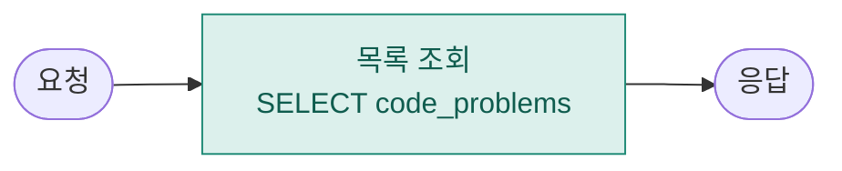

### `GET /code/problems/{id}` — 문제 상세

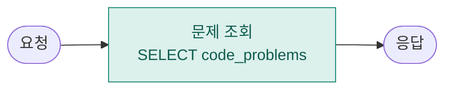

### `POST /code/problems/{id}/submit` — 코드 제출 + 리뷰

정확성·복잡도·보완점을 한 번에 LLM이 판단한다. "테스트케이스 통과"가 아니라
LLM이 코드를 읽고 내린 판단이라는 점을 프롬프트에 명시해 과신을 막는다.

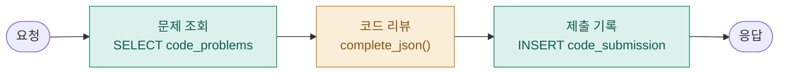

### `GET /code/submissions` — 제출 이력

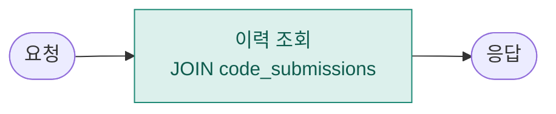

---

## Chat / Agent (`app/main.py`, `agent/loop.py`)

### `POST /chat` — tool-calling 에이전트 루프

다른 엔드포인트와 모양이 다르다 — 단발 호출이 아니라 `tool_calls`가 없어질
때까지 LLM을 최대 5회 반복 호출하는 루프. 지금 등록된 도구는 검증용 더미
`echo` 하나뿐 (`tools/schemas.py`의 `TOOLS`/`DISPATCH`).

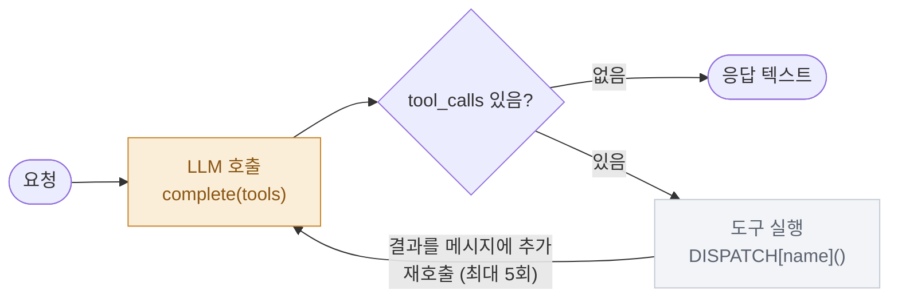

5회를 다 돌면 `"최대 반복 횟수에 도달했습니다"` 라는 고정 문구를 반환한다.

### `GET /health`

DB·LLM 없이 상태만 반환.

---

## 요약

| 구분 | 엔드포인트 |
|---|---|
| 매 요청 LLM 호출 (5) | `/concepts/interpret`, `/concepts/{id}/explain`, `/concepts/{id}/notes`(POST), `/code/problems/{id}/submit`, `/chat` |
| 조건부 LLM (2) | `/concepts/{id}/quiz`(mc만), `/concepts/{id}/quiz/answer`(free만) |
| LLM 없이 DB·로직만 (9) | `/concepts`(POST/GET), `/concepts/{id}/master`, `/notes`, `/concepts/{id}/notes`(GET), `/code/problems`, `/code/problems/{id}`, `/code/submissions`, `/health` |
