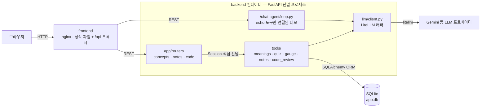

# 개념 사전 학습 앱

모르는/공부 중인 개념을 "내 사전"에 등록하고, LLM과의 반복 학습(퀴즈)을 통해
이해도 게이지를 채워가는 학습 앱. AI Service Engineering 트랙 실습
프로젝트로, 프론트 → 백엔드 → 에이전트/LLM → DB까지 한 서비스의 전 구간을
직접 설계하고 조립하는 것이 목표.

## 컨셉

- **등록**: 개념을 등록하면 LLM이 먼저 그 단어의 의미를 해석해서 보여준다.
  동음이의어일 가능성이 있으면 의미 후보 중 하나를 고르게 하고, 그렇지
  않으면 추론한 의미를 확인시켜준다 — 사용자가 알던 의미와 다르면
  "다시 추론"으로 다른 관점의 의미를 재요청할 수 있다. 이렇게 확정된 의미가
  이후 모든 퀴즈/채점/메모 판단의 기준이 된다.
- **학습**: 확정된 의미를 기준으로 객관식/서술형 퀴즈를 반복 풀며 이해도
  게이지(0~100%)를 채운다. 객관식은 정오답을 결정적으로 채점하고, 서술형은
  LLM이 채점자(judge) 역할로 점수+피드백을 준다. 100%에 도달하면 "마스터"
  처리 여부를 확인 후 사전에서 제외한다 (하드 삭제 아님 — 이력은 보존).
- **메모**: 개념마다 자유 메모를 남길 수 있고, 메모 본문에 다른 등록된
  개념이 언급되면 LLM이 자동으로 감지해 양방향 백링크로 연결한다.

## 기술 스택 / 아키텍처

- **Backend**: FastAPI + SQLAlchemy(SQLite 기본, ORM 한 겹 둬서 나중에
  Postgres 등으로 교체 가능) + LiteLLM
- **LLM**: 프로바이더 SDK 직접 호출 없이 전부 LiteLLM 경유
  (`MODEL` 환경변수로 모델 교체, 구조화 출력이 필요한 호출은 JSON 모드로 강제)
- **Frontend**: React + Vite (TypeScript). 별도 라우터 없이 상태 기반으로
  목록/상세 화면을 전환하는 단순 SPA
- **배포**: Docker Compose — 개발(볼륨마운트 + HMR/reload) / 프로덕션
  (빌드 + nginx) 두 모드를 분리

```
backend/
├── app/
│   ├── main.py           # FastAPI 앱, 라우터 등록, /health
│   ├── schemas.py        # 요청/응답 Pydantic 모델
│   └── routers/
│       ├── concepts.py   # 등록/의미해석/목록/퀴즈/마스터
│       ├── notes.py      # 메모 작성/조회
│       └── code.py       # 코드 문제 목록/제출/채점 (목업 화면 대응, LLM 리뷰)
├── agent/loop.py         # 에이전트 루프 (tool_calls 반복 호출) — /chat 데모용
├── llm/client.py         # LiteLLM 래퍼 (일반 completion + JSON 강제 completion)
├── tools/
│   ├── meanings.py       # 등록 전 의미 해석 (동음이의어 판별)
│   ├── quiz.py           # 퀴즈 생성 + 서술형 채점
│   ├── gauge.py          # 이해도 게이지 갱신 규칙
│   ├── notes.py          # 메모 언급 개념 추출 → 백링크 기록
│   ├── code_review.py    # 제출 코드 LLM 리뷰 (실행 아님 — 읽고 판단)
│   └── schemas.py        # 더미 echo 도구 (agent loop 배선 검증용)
├── db/
│   ├── base.py           # SQLAlchemy 엔진/세션 (DATABASE_URL로 교체 가능)
│   ├── models.py         # Concept, QuizAttempt, Note, NoteLink, CodeProblem, CodeSubmission
│   └── seed.py           # 코드 문제 시드 데이터 (기동 시 비어있으면 채움)
├── tests/                 # pytest — LLM은 ScriptedLLM으로 스크립트 처리, 실호출 없음
├── rag/retriever.py       # RAG 인터페이스 자리만 마련 (미구현 스텁)
├── pyproject.toml / Dockerfile / .env.example

frontend/
├── src/
│   ├── api.ts               # 백엔드 호출 래퍼 + 타입 정의
│   ├── App.tsx               # 목록 ↔ 상세 화면 전환
│   └── components/
│       ├── ConceptList.tsx    # 사전 목록 + 등록 폼
│       ├── MeaningModal.tsx   # 등록 시 의미 확인/선택 모달
│       ├── ConceptDetail.tsx  # 퀴즈 + 게이지 + 마스터 확인 모달
│       ├── NotesPanel.tsx     # 메모 작성 + 백링크 표시
│       └── GaugeBar.tsx
├── vite.config.ts / nginx.conf / Dockerfile / package.json

compose.yml       # 프로덕션: backend + frontend(nginx) 컨테이너
compose.dev.yml   # 개발: 볼륨마운트 + 백엔드 --reload / 프론트 HMR
```

## 시스템 구성

컨테이너는 둘뿐이다(`frontend`, `backend`). 라우터·도구·LLM 클라이언트·DB 세션이
전부 `backend` 프로세스 하나 안에 있고, 라우터가 도구에 SQLAlchemy `Session`을
직접 넘겨준다 — 즉 "에이전트(도구)"가 DB를 몰라야 한다는 경계는 없고, 라우터가
그 자리에서 도구를 호출하는 오케스트레이터 역할을 한다.



`agent/loop.py`는 이름과 달리 지금은 `/chat` 데모용 껍데기다 — 실제 기능(의미
해석, 퀴즈 생성/채점, 게이지 갱신, 메모 멘션 추출)은 전부 라우터가 도구 함수를
직접 호출하는 방식으로 동작하고, 각 호출은 "LLM에게 구조화된 판단 한 번 요청"이지
여러 스텝을 스스로 고르는 자율 루프가 아니다.

## API

| Method | Path | 설명 | LLM 호출 |
|---|---|---|:---:|
| POST | `/concepts/interpret` | 등록 전 의미 해석 (동음이의어 판별) | O |
| POST | `/concepts` | 개념 등록 `{term, definition}` | X |
| GET | `/concepts` | 사전 목록 (`status=active` 기본) | X |
| POST | `/concepts/{id}/quiz` | 퀴즈 생성 `{type: mc\|free}` | mc만 O |
| POST | `/concepts/{id}/quiz/answer` | 채점 + 게이지 갱신 | free만 O |
| POST | `/concepts/{id}/master` | 마스터 처리 (소프트 삭제) | X |
| POST | `/concepts/{id}/notes` | 메모 작성 → 언급 개념 자동 추출 | O |
| GET | `/concepts/{id}/notes` | 메모 조회 (내 메모 + 백링크 메모) | X |
| GET | `/code/problems` | 코드 문제 목록 (기동 시 시드 데이터) | X |
| GET | `/code/problems/{id}` | 코드 문제 상세 | X |
| POST | `/code/problems/{id}/submit` | 코드 제출 → LLM 리뷰(실행 아님) + 기록 | O |
| GET | `/code/submissions` | 제출 이력 | X |

각 엔드포인트가 실제로 어떤 순서로 LLM/DB를 타는지는 [API_FLOW.md](./API_FLOW.md) 참고.

## 실행 방법

### 1) Docker Compose (기본/프로덕션)

```bash
cp backend/.env.example backend/.env   # GEMINI_API_KEY 값 채우기
docker compose up --build
```

프론트 컨테이너 주소(`http://localhost`)로 접속. nginx가 정적 파일을 서빙하고
`/api/*` 요청을 backend 컨테이너로 프록시한다.

### 2) Docker Compose (개발 모드, HMR)

```bash
cp backend/.env.example backend/.env
docker compose -f compose.dev.yml up --build
```

- 프론트: `http://localhost:5173` — 소스 볼륨마운트 + Vite dev 서버(HMR)
- 백엔드: `http://localhost:8000` — 소스 볼륨마운트 + `uvicorn --reload`
- SQLite DB(`backend/app.db`)는 볼륨마운트된 경로에 자동 생성되며, 컨테이너를
  껐다 켜도 데이터가 유지된다.

### 3) 로컬에서 직접 실행 (Docker 없이)

백엔드:

```bash
cd backend
cp .env.example .env
uv sync   # 또는: pip install fastapi "uvicorn[standard]" litellm python-dotenv sqlalchemy
uv run uvicorn app.main:app --reload
```

프론트:

```bash
cd frontend
npm install
npm run dev
```

## 기술 원칙

- 모든 LLM 호출은 LiteLLM 경유 — 프로바이더 SDK 직접 호출 금지
- 모델 문자열은 `MODEL` 환경변수로 분리 — 값만 바꾸면 다른 프로바이더/모델로 교체 가능
- 모듈 분리 유지: `llm/`, `tools/`, `agent/`, `rag/`, `db/` — 단일 파일에 몰아넣지 않기
- 퀴즈 생성/채점/멘션추출 등 판단이 필요한 LLM 호출은 항상 구조화 출력(JSON)으로 강제
- 마스터 처리는 소프트 삭제(status 변경)만 — 학습 이력·데이터는 삭제하지 않음
- DB는 SQLAlchemy ORM 한 겹을 둬서, SQLite → Postgres 등으로 교체할 때
  모델/쿼리 코드를 건드리지 않아도 되게 유지
- `.env.example`에는 키 이름만, 실제 값은 `.env`(gitignore)에만

## 학습 목표

단순히 "AI API를 붙인 화면"이 아니라 **에이전트 루프 → LiteLLM → 구조화 출력
→ FastAPI/ORM → Docker 배포**까지 이어지는 전 구간을 직접 조립해보는 것이
이 트랙의 목표. 이번 프로젝트로 실제로 손으로 만져본 것들:

- **서버/API**: 요청-응답 흐름, 입력 검증(Pydantic), 상태 코드/에러 처리
- **에이전트 도구 호출**: 모델이 구조화된 판단(의미 해석/채점/멘션추출)을
  내리게 하고, 그 결과를 애플리케이션 로직(게이지 갱신, 백링크 기록)에
  연결하는 패턴
- **LLM 비용/토큰 감각**: 무료 티어 요청 한도, reasoning(thinking) 토큰이
  실제 비용에 미치는 영향, `reasoning_effort` 같은 파라미터로 조절하는 법
- **인프라**: Docker Compose로 다중 컨테이너 구성, 개발/프로덕션 모드 분리

RAG/벡터DB(`rag/retriever.py`)는 아직 인터페이스만 마련된 스텁 상태 — 다음
단계 후보.
